#Conectarse al servidor.

priemro haremos que putty cree una key ssh a partir de el .pam que nos proporciona AWS_amazon al crear el seridor 
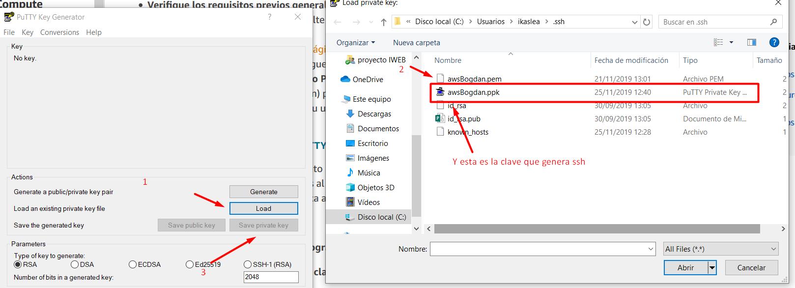

Después nos conectaremos utilizando la url de aws
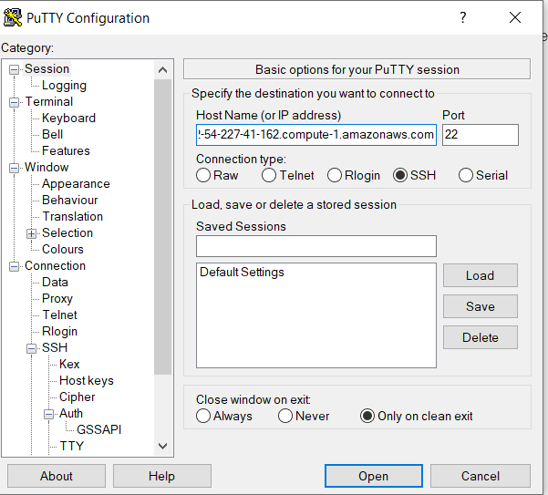

Y ahora nos conectamos al servidor(En esta captura me estoy conectando por la consola de windows, pero al conectarse por putty)
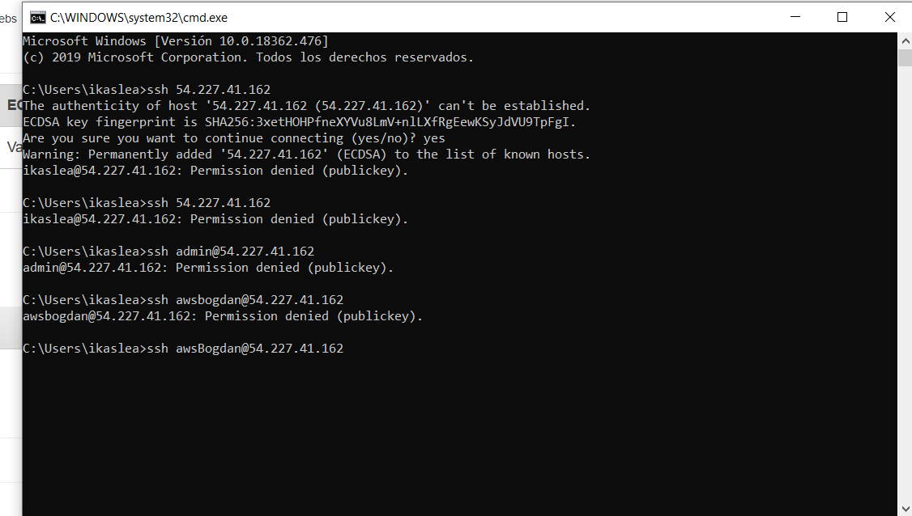

Antes de nada actualizamos las librerias
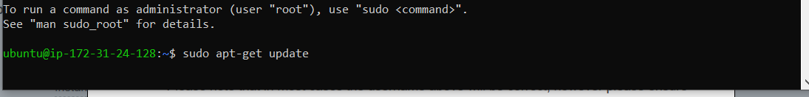

Y después seguiremos con apache:
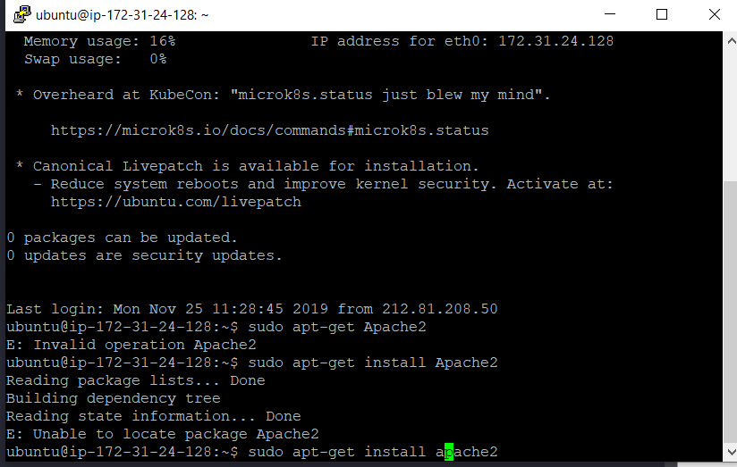

Yendo a la ruta de de nuestro servidor podremos comprobar que se ha instalado correctamente.
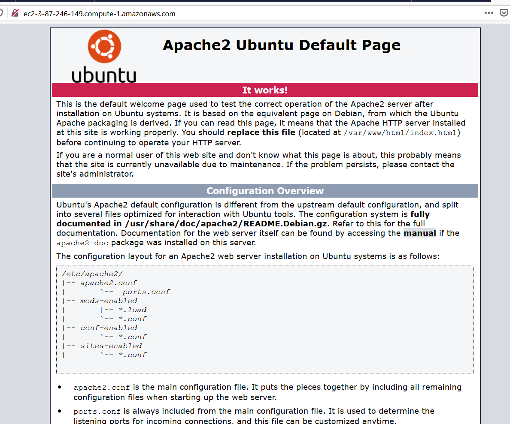

Ahora instalaremos phpMyAdmin
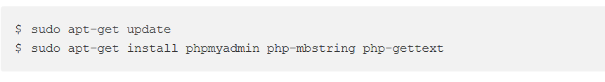

Ahora iremos paso a paso con la instalación.
1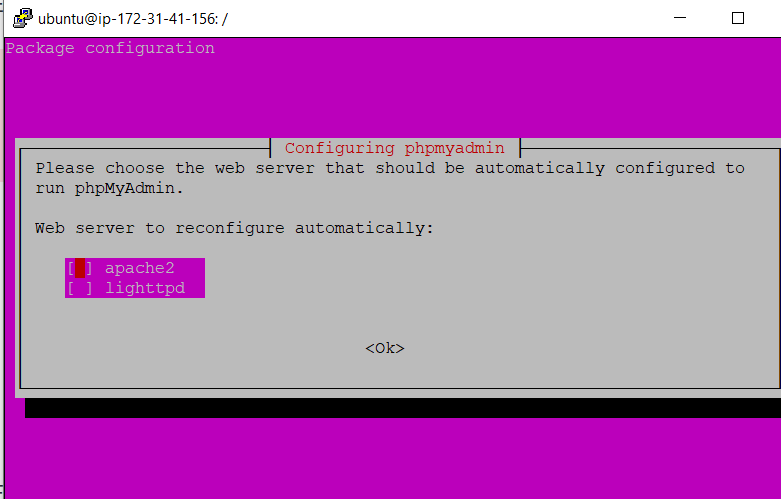
2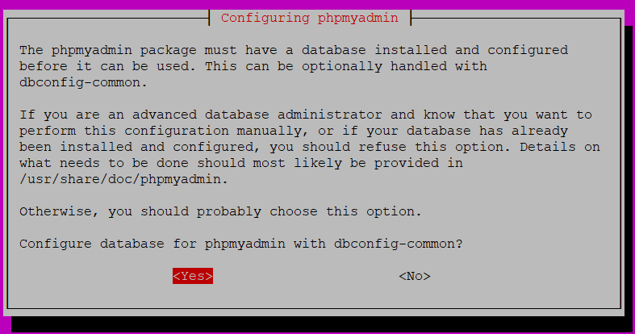
3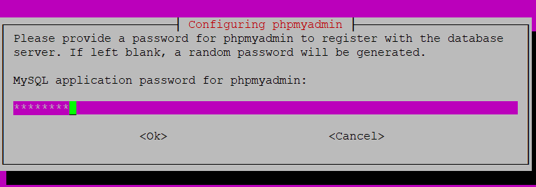
y por último yendo a esta ruta veremos si se ha isntalado correctamente
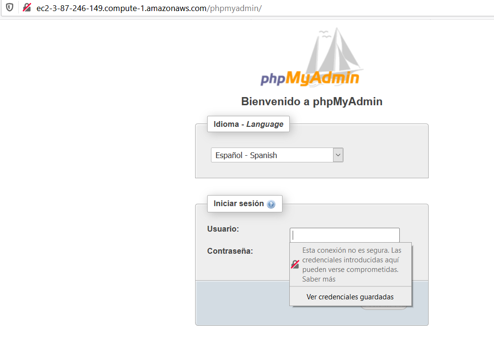

Ahora insntalaremos sql a ire poniendo las capturas de los pasos.
1

2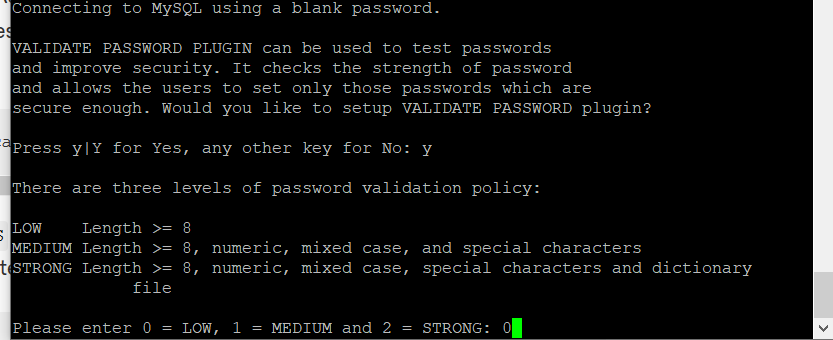
3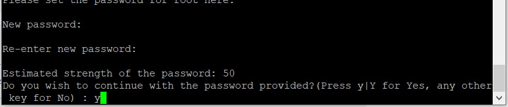
4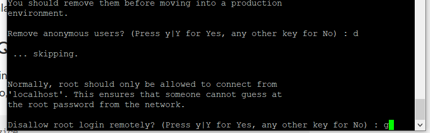
5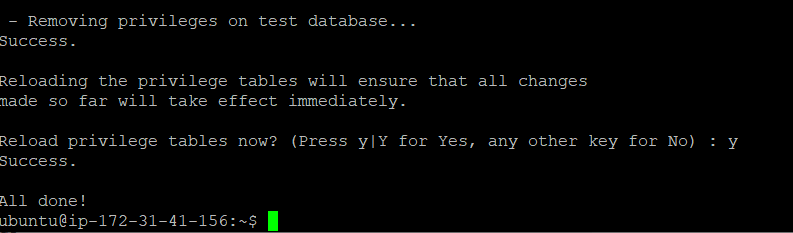

Y por útlimo instalaremos php
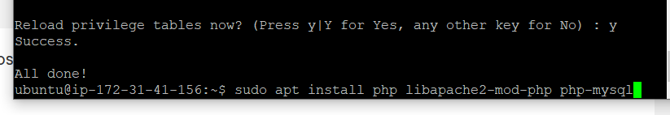
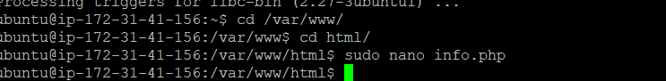

Y ahora comrobaremos que se ha instalado correctamente, en el archivo creado solo hemos puesto la funcion de php info.
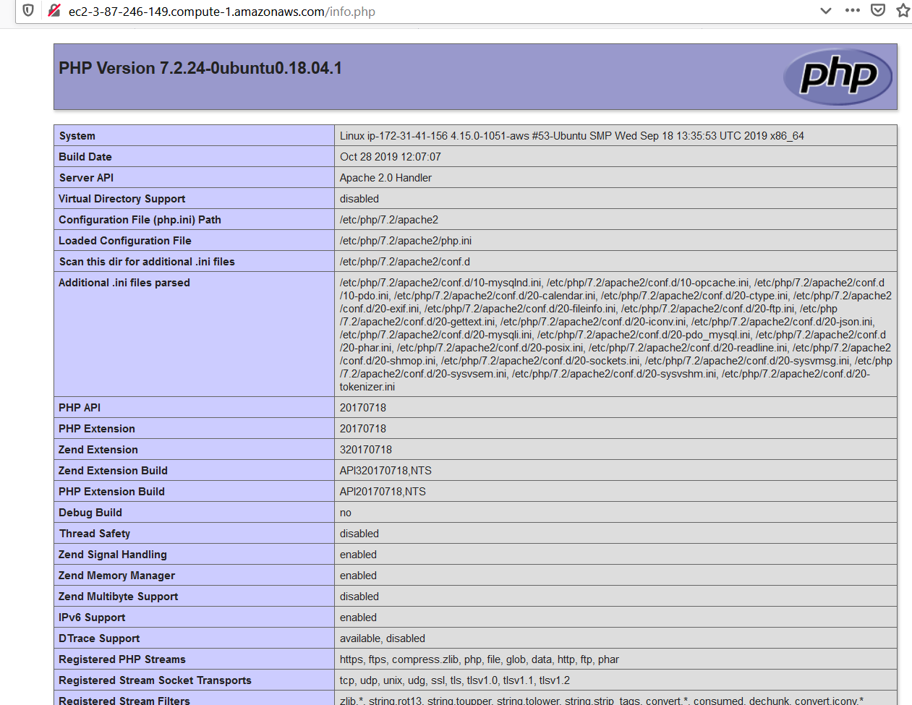

