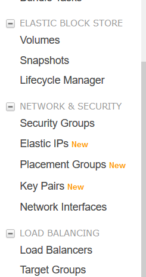
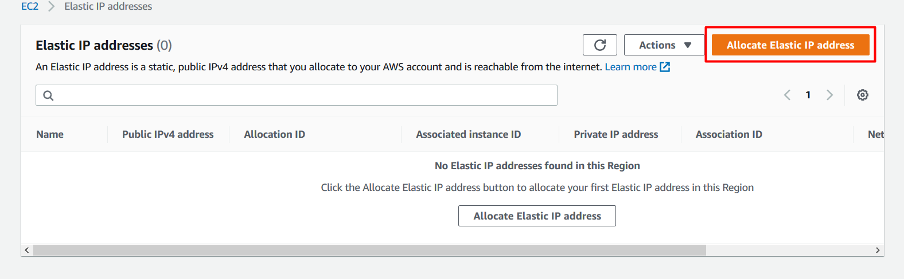
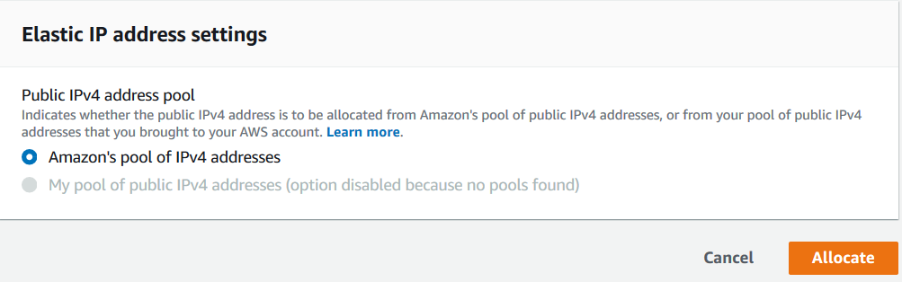
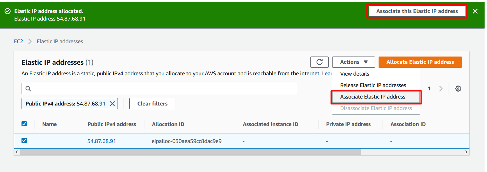
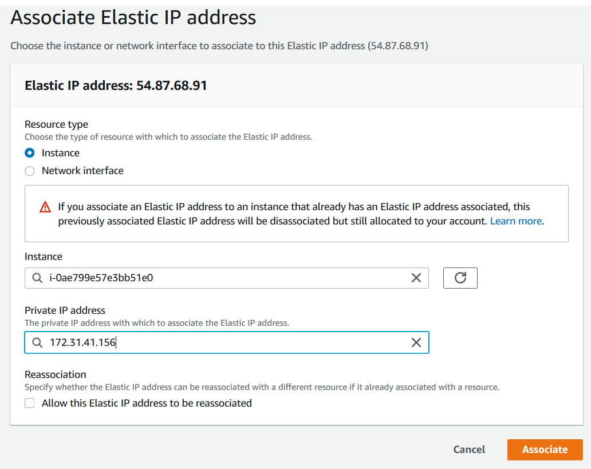
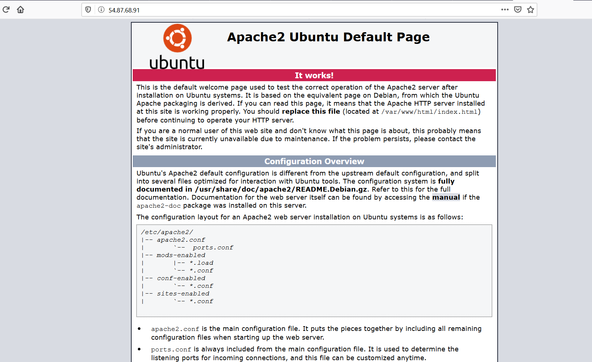

##Tarea 2 

El primer paso es crear una ip flexible. lo que hara esta ip flexible sera unir una ip "fija" a nuestro servidor así que aun que nuestro servidor cambie de ip todos los dias la ruta seguira siendo la misma.

Elegimos la opcion de Elastic IP

Elegiremos la opcion de crear nunesra primera ipFleaxible 

Despues de crearla tendremos que enlazarla con nuestro srvidor.

Elegimos la instancia y despues su ip

En esta captura comprobaremos que nuestro servidor y nuestra ip felxible estan sincronizados correctamente.
