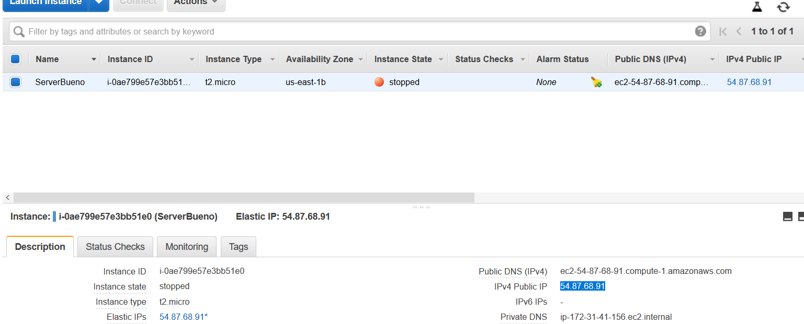

##CREAR UN DNS PARRA EL SERVIDOR

1.1.Lo primero qu etendremos que hacer será registrar nuestro DNS.

1.2.Ahora elegiremos el Nombre de nuestro dominio,  desues la latenia que queramos que tenga, el tipo elegiremos el A (A= IPv4, CNAME=direcciónes URLs y AAAA=IPv6)

1.3Comprobamos que la ip que ponemos es la de nuestro servidor 

1.5Ya tenemos registrado nuestro nevo DNS, podemos comprobarlo aquí: 

