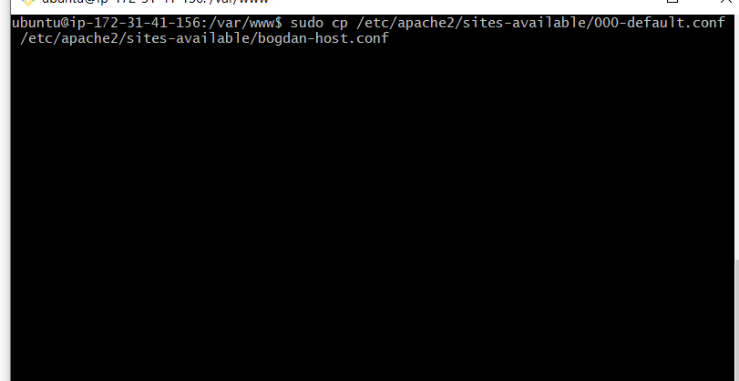
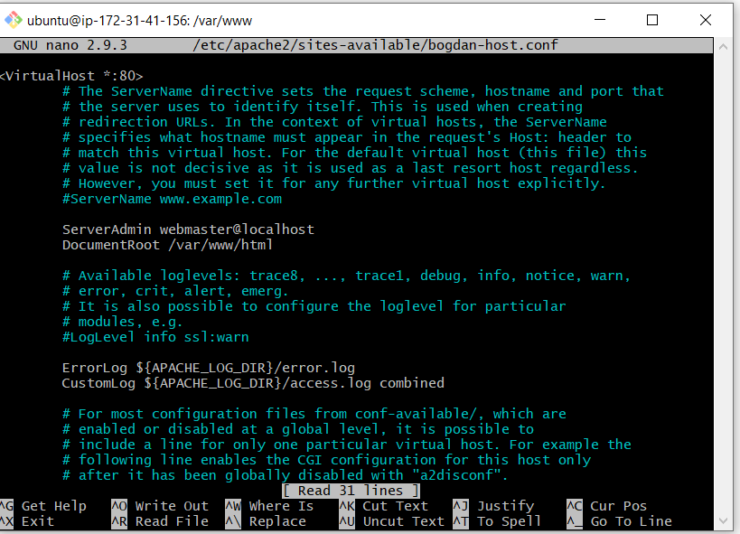
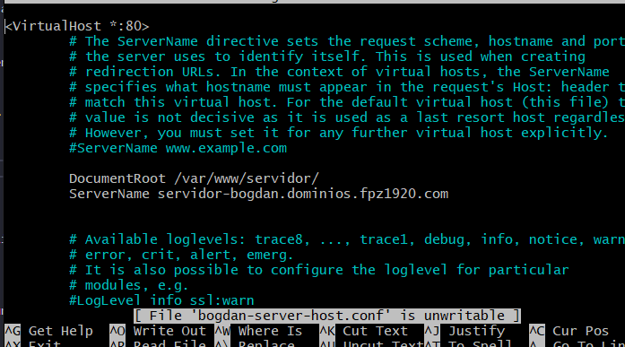
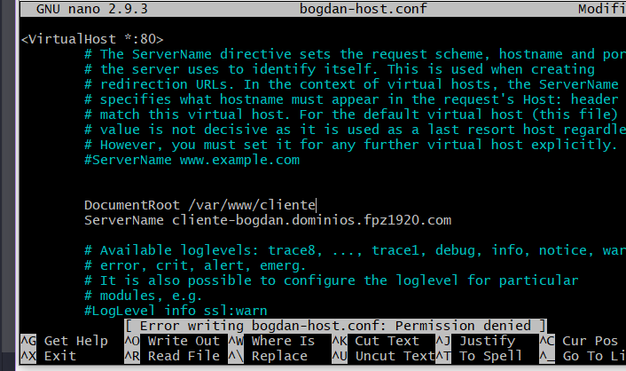
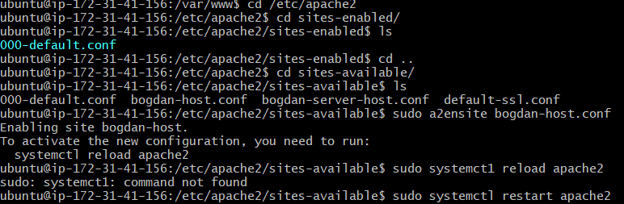
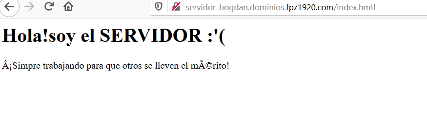
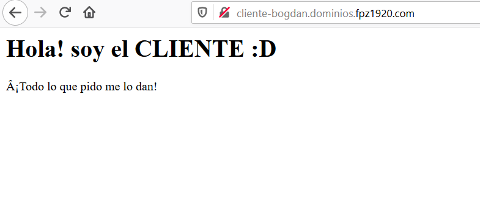

#Crear un host 
1 lo primero que tendremos que hacer es copiar el archivo 00-default.conf
para editar nuestor archivos a partir de ese archivo.

1.1
Esto es lo que tenemos que tener en el archivo recien copiado.

2-Ahora lo quue hay que hacer es remplazar lo que venia puesto y poner nuestras rutas. 

2.1-asi quedaría el cliente.

3 - ahora tendremos que habilitar nuestros sitios con e comando a2ensite y reiniciar 

4 -  y ahora ya tenemos en funcionamiento nuestros sitios 

