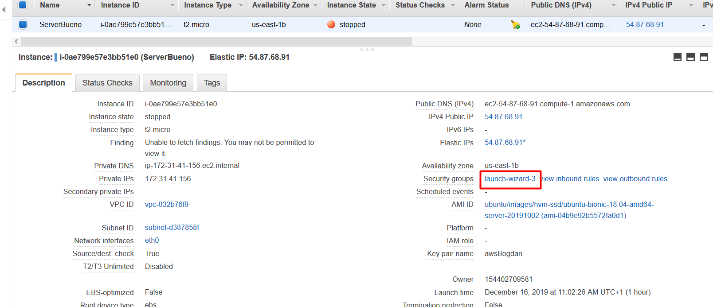
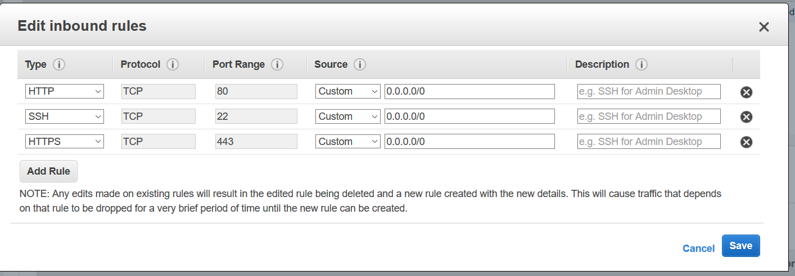
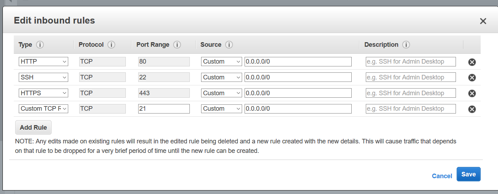
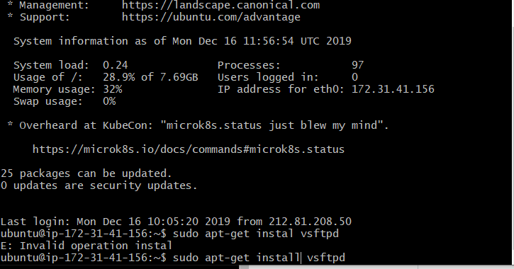
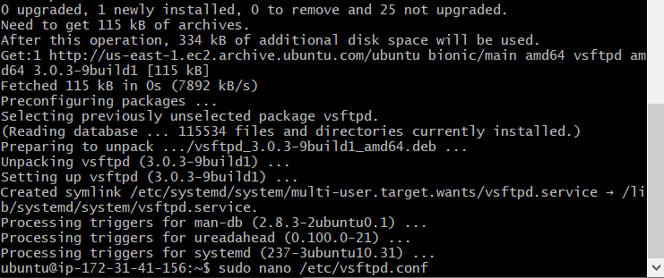
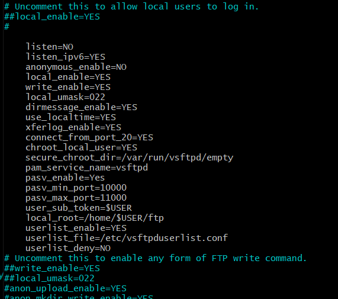
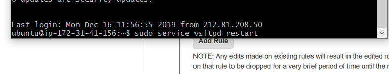

#CONFIGURAR SERVIDOR FTP

1 lo primero que tendremos que hacer es habilitar las conexiones FTP
a-

b-

c-

2 Ahora tenemos que instalar el serfvidro FTP y configurarlo.
a- 

b- 

c- 

2 Y por ultimo reiniciaremos el servidor
a-

