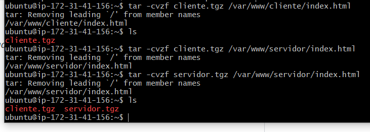
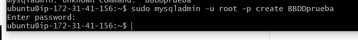
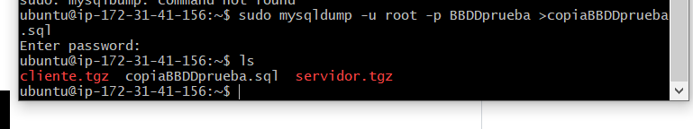

#Creacion de copias de seguridad mediante comandos

1 lo primero que hay que hacer es comprimir las carpetas del cliente y el servidor con estos comandos:

`` tar -cvzf cliente.tgz /var/www/cliente/ ``
a-

2 Ahora crearemos una base de datos:
`` sudo mysqladmin -u root -p create *nombre-de-DDBB*``

NOTA: podemos ponerle contraseña o no.
a-

3 y por ultimo exportaremos la BBDD: 
`` sudo mysqldump -u root -p *nombre-BBDD-a-exportar* > *nombre-BBDD-exportada*.sql``
a-

