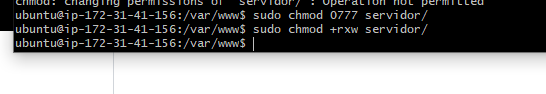

#Creacion de copias de seguridad mediante comandos

1 primero crearemos una carpeta en la que guardaremos las copias de seguridad:


2 ahora crearemos un archivo para poder iniciar los .sh

NOTA: En la magen lo tengo creado en la carpeta de backups, pero eso no tiene sentido. El archivo tiene que estar creado las carpetas del cliente o servidor, para poder cceder a el desde internet .


3 : cambiamos los permisos y el usuario al a las carpetas y del servidor para que no de problemas a la hora de ejecutarlo el backup



4: Para configurar el script especificamos el usuario, contraseña, donde y con que nombre cuardaremos los archivos. Después espacificamos donde estan los archivos a los que le haremos la copia de seguridad.

5 por ultimo con ```crontab -e``` configuraremos las copias para que se hagan peridicamente y que borre las copias que fueron creadas hace 7 dias 


